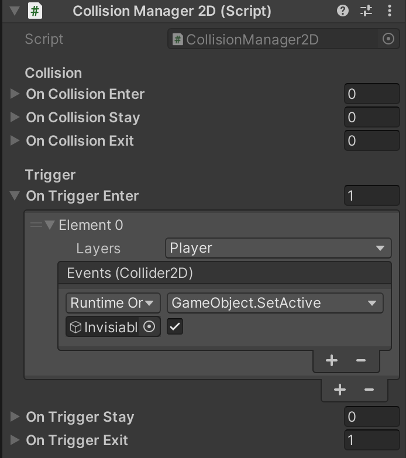

# CollisionManager2D

Provide the ability to edit collision/trigger events in editor.

## Installation

```bash
yarn add "https://gitpkg.now.sh/DiscreteTom/unity3d-utils/2D/CollisionManager2D?main"
```

## Usage


