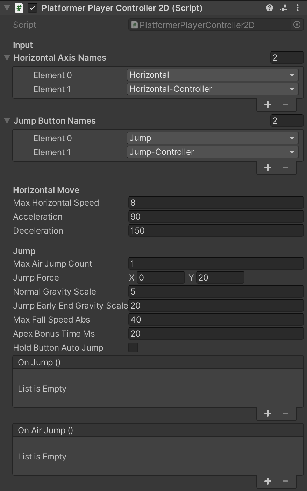
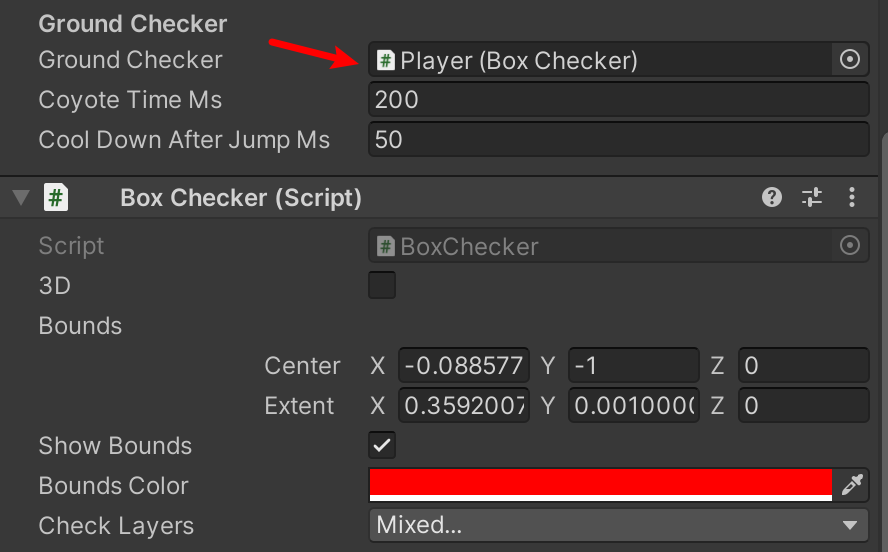

# PlatformerPlayerController2D

## Installation

```bash
yarn add "https://gitpkg.now.sh/DiscreteTom/unity3d-utils/2D/PlatformerPlayerController2D?platformer-player-controller-2d-0.1.0"
```

[NaughtyAttributes](https://github.com/dbrizov/NaughtyAttributes) is also needed.

## Usage

Add this component to a game object:



Then add a collision checker component, set it to the controller's Ground Checker:



Finally, make sure input axis/button names are right, then enjoy!
