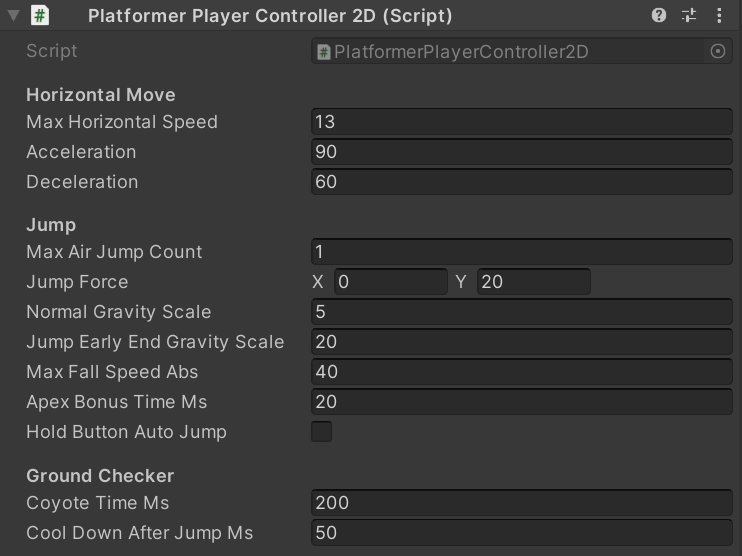

# PlatformerPlayerController2D

## Installation

```bash
yarn add "https://gitpkg.now.sh/DiscreteTom/unity3d-utils/2D/PlatformerPlayerController2D?platformer-player-controller-2d-0.2.0"
```

## Usage



```cs
using DT._2D;
using UnityEngine;

public class Player : MonoBehaviour {
  PlatformerPlayerController2D controller;
  Rigidbody2D body;

  void Start() {
    this.controller = this.GetComponent<PlatformerPlayerController2D>();
    this.body = this.GetComponent<Rigidbody2D>();
  }

  void Update() {
    var result = this.controller.Move(new PlatformerPlayerController2D.MoveInput {
      horizontal = Input.GetAxisRaw("Horizontal"),
      jumpBtnDown = Input.GetButtonDown("Jump"),
      jumpBtnUp = Input.GetButtonUp("Jump"),
      jumpBtnHeld = Input.GetButton("Jump"),
      grounded = Physics2D.Raycast(this.transform.position, Vector2.down, 0.6f, LayerMask.GetMask("Default")).collider != null,
      velocity = this.body.velocity,
      gravityScale = this.body.gravityScale,
      deltaTime = Time.deltaTime
    });
    this.body.gravityScale = result.gravityScale;
    this.body.velocity = result.velocity;
    if (result.jumped) this.body.AddForce(this.controller.jumpForce, ForceMode2D.Impulse);
  }
}
```
