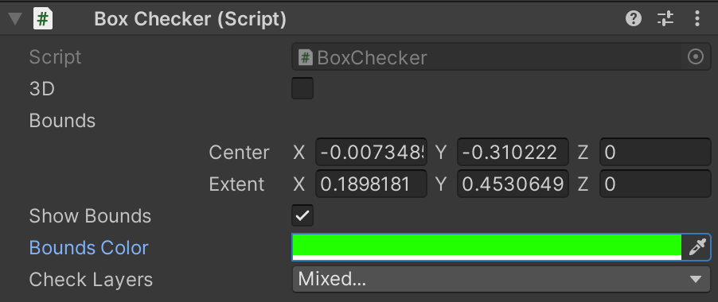
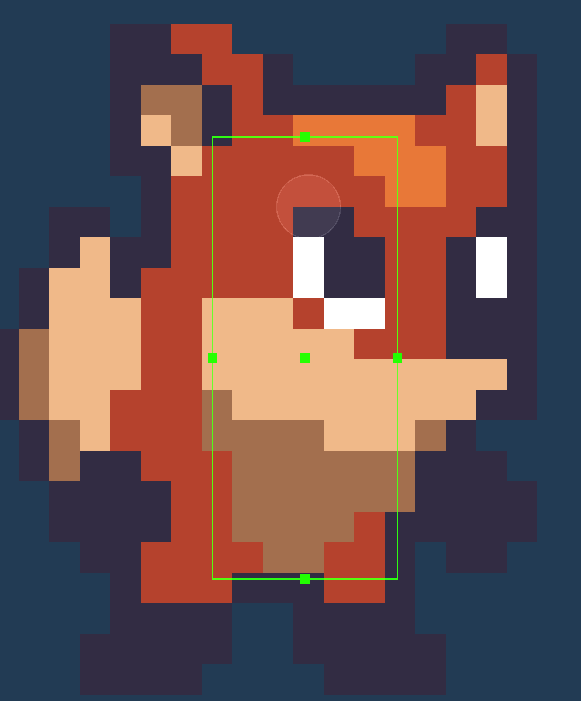

# CollisionChecker

## Installation

```bash
yarn add "https://gitpkg.now.sh/DiscreteTom/unity3d-utils/General/CollisionChecker?collision-checker-0.1.0"
```

[NaughtyAttributes](https://github.com/dbrizov/NaughtyAttributes) is also needed.

## Usage

Add a checker component to a game object:



Visually edit bounds in the Scene window:



Check collisions in code:

```cs
public BaseCollisionChecker groundChecker;
groundChecker.Check(); // true/false
```
