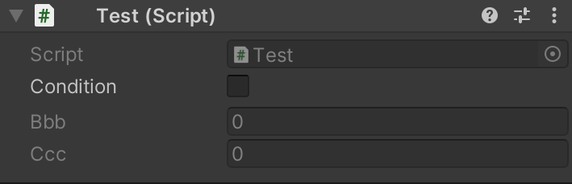
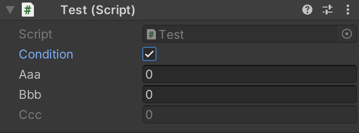
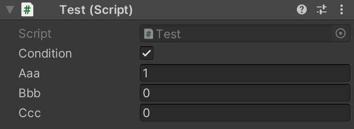

# ConditionalField

Hide or disable class field in the Unity3D Editor Inspector using attributes.

## Installation

```bash
yarn add "https://gitpkg.now.sh/DiscreteTom/unity3d-utils/General/ConditionalField?main"
```

## Usage

```cs
using UnityEngine;
using DT.General;

public class Test : MonoBehaviour
{
  // define a condition field
  public bool condition;

  // show this field if condition is true
  [ShowIf("condition")]
  public int aaa;

  // enable this field if condition is true
  [EnableIf("condition")]
  public int bbb;

  // method can also be the condition
  public bool ComplexCondition() => aaa > 0;

  // enable this field if ComplexCondition returns true
  [EnableIf("ComplexCondition")]
  public int ccc;
}
```




