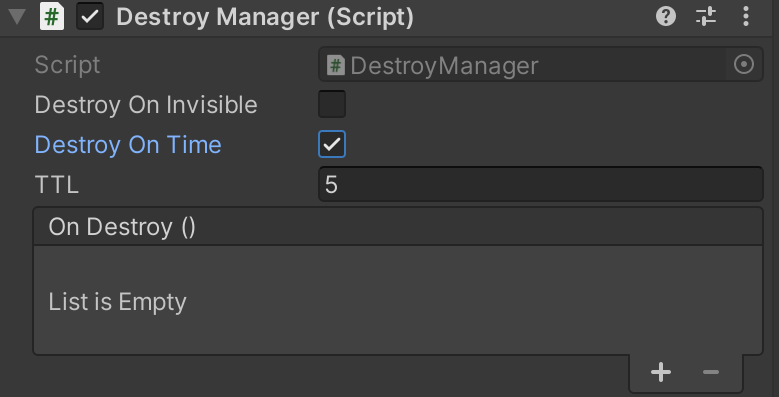
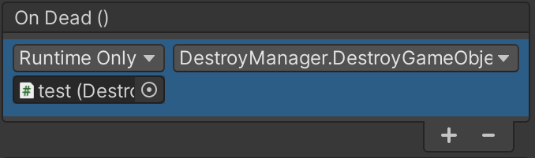

# DestroyManager

Destroy or set destroy event handler in Unity3D inspector.

## Installation

```bash
yarn add "https://gitpkg.now.sh/DiscreteTom/unity3d-utils/General/DestroyManager?main"
```

## Usage

Set `OnDestroy` events in inspector:



Or call `DestroyManager.DestroyGameObject`.


